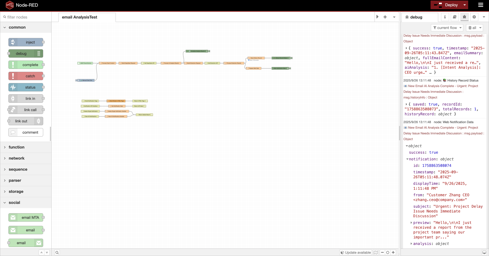
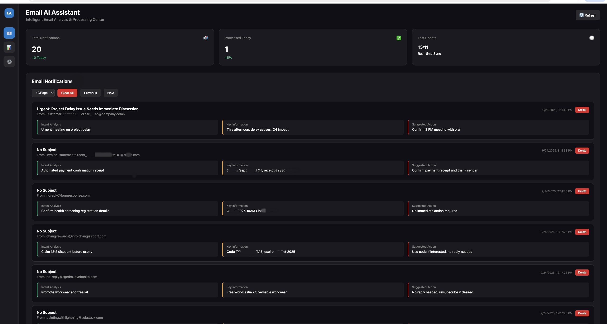
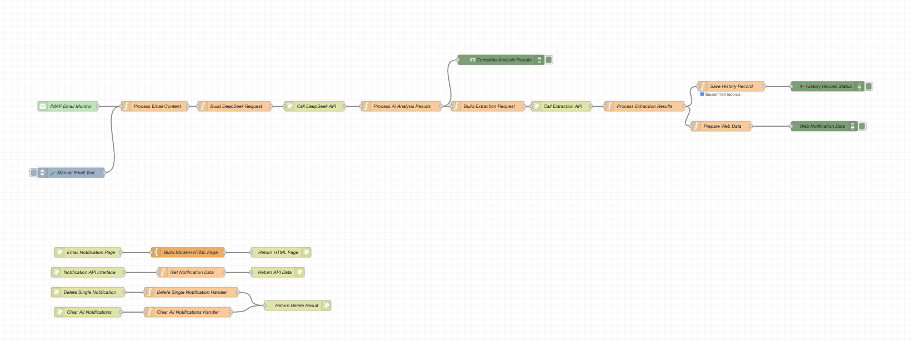

# Email AI Assistant - DeepSeek Integration

An intelligent email analysis assistant based on Node-RED, utilizing DeepSeek AI API for email content analysis and reply suggestions.

> 🌟 **Node-RED Official Flow Library**: This project has been uploaded to the Node-RED official flow library. You can import and use it directly: [https://flows.nodered.org/flow/ad230f600644964156ffb18db2f16ade](https://flows.nodered.org/flow/ad230f600644964156ffb18db2f16ade)

> 📦 **npm Package**: This project has been published as an npm package. You can install and use it directly: [node-red-contrib-email-analysis-deepseek](https://www.npmjs.com/package/node-red-contrib-email-analysis-deepseek)

## 📸 Project Preview

### Complete System Interface


### Main Interface



## 🚀 Features

- **Intelligent Email Analysis**: Automatically analyzes email content and extracts key information
- **Intent Recognition**: Quickly understands the sender's real intent and needs
- **Reply Suggestions**: Provides professional and targeted reply recommendations
- **Real-time Monitoring**: Automatically monitors IMAP email accounts and processes new emails in real-time
- **History Tracking**: Saves email analysis history for easy review
- **Web Interface**: Modern web dashboard for intuitive display of analysis results
- **Multilingual Support**: Supports both Chinese and English versions, with Chinese version outputting analysis results in Chinese and English version outputting in English

## 🚀 Quick Start

### Method 0: Use GitHub Codespaces (Easiest - No Local Installation!)

> 🎉 **New!** This project is fully configured for GitHub Codespaces. Use it directly in your browser!

1. Click the green **"Code"** button on GitHub
2. Select **"Codespaces"** tab
3. Click **"Create codespace on main"**
4. Wait for environment setup (1-2 minutes)
5. Edit `.env` file and add your API keys
6. Run `./start-nodered.sh` to start Node-RED
7. Access Node-RED at the forwarded port 1880

📚 **Detailed guide**: See [CODESPACES.md](CODESPACES.md) for complete instructions.

### Method 1: Install npm Package (Simplest)
```bash
cd ~/.node-red
npm install node-red-contrib-email-analysis-deepseek
```
After restarting Node-RED, find the "Email Analysis DeepSeek" node in the node palette and drag it into your flow to use.

#### Node-RED Flow Example


### Method 2: Import from Node-RED Official Flow Library
1. Visit [Node-RED Official Flow Library](https://flows.nodered.org/flow/ad230f600644964156ffb18db2f16ade)
2. Click "Copy JSON" to copy the flow code
3. Import the flow in Node-RED (Ctrl+I → Import from Clipboard)
4. Configure API keys and email authentication according to [SETUP.md](SETUP.md)
5. Deploy and access the web interface

### Method 3: Import from Project Files
1. Clone or download this project
2. Complete environment configuration according to [SETUP.md](SETUP.md) setup guide
3. Import flow files from the `flows/` directory into Node-RED
4. Configure API keys and email authentication
5. Deploy and access the web interface

## 📁 Project Structure

```
email-analysis-deepseek/
├── flows/
│   ├── flow-english.json          # English version Node-RED flow
│   └── flow-chinese.json          # Chinese version Node-RED flow
├── README.md                      # Project documentation
├── SETUP.md                       # Configuration guide
├── LICENSE                        # MIT License
├── .gitignore                     # Git ignore rules
└── noderedGraphics/               # Project screenshots
    ├── nodered-flow.png
    ├── noderedFlowLibrary.png
    ├── website-UI-3.jpg
    └── WholePage.png
```

## 🛠️ Technology Stack

- **Node-RED**: Flow orchestration and automation platform
- **DeepSeek API**: AI analysis and content generation
- **IMAP**: Email receiving protocol
- **HTML/CSS/JavaScript**: Web interface
- **Node.js**: Runtime environment

## 📋 Main Components

### 1. Email Monitoring Module
- Uses IMAP protocol to monitor Gmail accounts
- Supports OAuth2 authentication
- Automatically detects new emails

### 2. AI Analysis Module
- Integrates DeepSeek Chat API
- Intelligent analysis of email content and intent
- Extracts key information and action recommendations

### 3. Data Processing Module
- Saves analysis history records
- Generates notification data
- Manages statistical information

### 4. Web Interface Module
- Modern dashboard design
- Real-time data display
- Notification management functionality

## 🎯 Core Features

### Email Analysis Workflow
1. **Email Reception**: IMAP listener automatically receives new emails
2. **Content Extraction**: Extracts key information such as sender, subject, content
3. **AI Analysis**: Uses DeepSeek API for intelligent analysis
4. **Result Processing**: Parses AI responses, extracts intent, key information, and action recommendations
5. **Data Storage**: Saves analysis results and history records
6. **Notification Generation**: Creates web notification data

### Analysis Dimensions
- **Intent Analysis**: Identifies the real purpose of emails and sender needs
- **Key Information**: Extracts important information such as time, location, people
- **Action Recommendations**: Provides specific reply suggestions and follow-up actions

## 🌐 Web Interface Features

- **Real-time Monitoring**: Displays latest email analysis results
- **History Viewing**: Browse past analysis records
- **Statistics**: Shows processing counts and trends
- **Notification Management**: Delete and clear notification functionality

### Interface Preview

## 📊 Data Management

### History Records
- Automatically saves email analysis history
- Configurable retention count (default: 30 records)
- Includes complete analysis results and metadata

### Notification System
- Real-time email notification generation
- Supports batch management operations
- Automatic cleanup of expired notifications

## 🔧 Configuration Requirements

### Required Configuration
- DeepSeek API key
- Gmail OAuth2 authentication
- Node-RED environment

### Optional Configuration
- History record retention count
- Notification cleanup strategy
- Analysis parameter tuning

## 📈 Performance Features

- **Efficient Processing**: Optimized API calls and data processing
- **Error Handling**: Comprehensive exception handling and fallback mechanisms
- **Resource Management**: Automatic cleanup and memory optimization
- **Scalability**: Modular design for easy extension

## 🔒 Security Considerations

- Secure API key storage
- OAuth2 secure authentication
- Sensitive information sanitization
- Input validation and filtering

## 📝 Use Cases

- **Business Email Processing**: Quickly understand customer needs and reply suggestions
- **Email Classification**: Automatically identify email importance and urgency
- **Reply Assistant**: Provide professional reply templates and suggestions
- **Email Monitoring**: Real-time monitoring of important emails and notifications

## 🤝 Contributing

Welcome to submit Issues and Pull Requests to improve the project.

## 📄 License

This project is licensed under the MIT License. See the [LICENSE](LICENSE) file for details.

---

**Note**: Please ensure all required API keys and authentication information are properly configured before use. For detailed configuration steps, please refer to [SETUP.md](SETUP.md).
